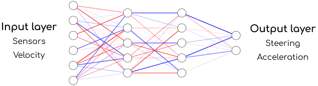
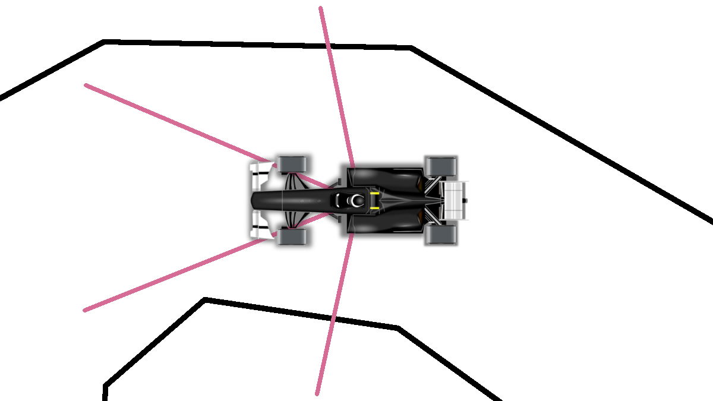
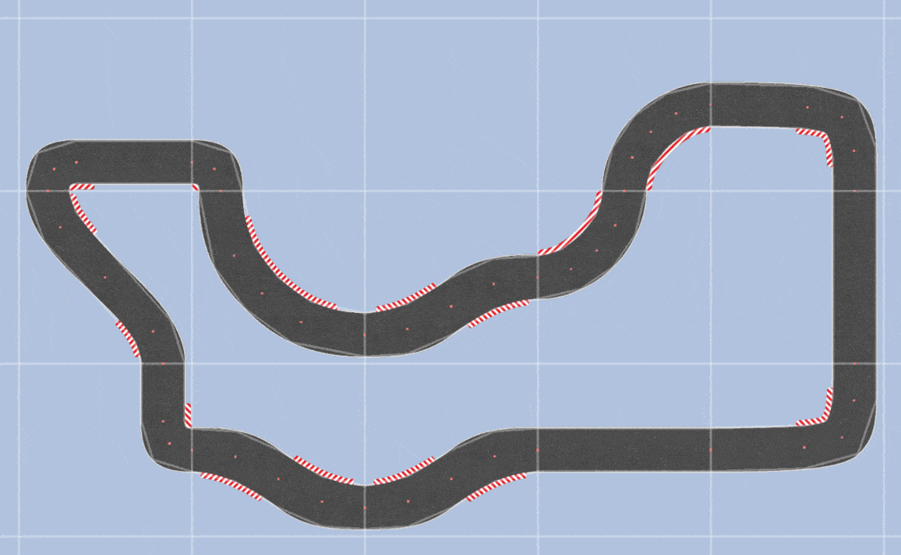

# neural_network_driving

NeuralNetworkRacing
Neural network learns how to drive a car on a track. Simple 2D simulation with pyglet & numpy.

This code is adapted from https://github.com/TomasBrezina/NeuralNetworkRacing/tree/master


https://github.com/user-attachments/assets/6b8d7ee8-504f-4ade-badd-6a0af647ceb3


▶️️ HOW TO RUN?
Install packages
```
pip install -r requirements.txt
```

NeuralNetworkRacing/requirements.txt

Lines 1 to 3 in e6ff65a

 pyglet == 1.5.29 
 numpy 
 pillow 
Run main file
Should work with Python 3.0 and higher.

For example:

py -3.10 .\__main__.py
Or use a virtual environment.

Config (Optional)
config.json

```
{
    "width": 1280
    "height": 720
    "friction": 0.1
    "render_timestep": 0.025 // time between frames in seconds - 0.025s = 40 FPS
    "timeout_seconds": 30 // maximum time for each gen
    "population": 40 // number of cars
    "mutation_rate": 0.6 // mutation rate after gen
}
```

default_nn_config.json - Default car config for new saves.
```
{
    "name" : "test" 
    "acceleration": 1
    "friction": 0.95
    "max_speed": 30 
    "rotation_speed": 4
    "shape": [6, 4, 3, 2] // neural network shape - do not change first and last layer
    "max_score": 0
    "gen_count": 0
}
```
🕸️ NEURAL NETWORK
nn-architecture


🧬 EVOLUTION
Best cars in each generation are chosen to be the parents of the next, slightly mutated generation.

| First Header  | Second Header |
| ------------- | ------------- |


|||
| ------------- | ------------- |
🏎️ ENVIROMENT & TRACK GENERATION
image	track-generation
⚖️ LICENSE
Shield: CC BY-NC 4.0

This work is licensed under a Creative Commons Attribution-NonCommercial 4.0 International License.

CC BY-NC 4.0
